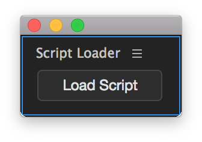

# Script Loader for Adobe Audition

Script loader for Adobe Audition is a small and simple extension for Adobe Audition intended for extension developers to easily load JSX scripts into Audition for testing outside of extensions. 

It could also be used by end users as well for "user scripts" similar to scripts for InDesign, Photoshop and Illustrator. But there may be better approaches for this than a panel with a button.

## Usage
Have a .jsx or .js script ready that has been written specifically for Adobe Audition, press the load script button and choose your script in the dialog.

## TODO
- Find a way to load scripts in a user friendly way for end users to use scripts in Adobe Audition

## License
The source code is licensed under the MIT license.